I'm primarily using this guide by SpectralCoding from this [r/sysadmin reddit post](https://old.reddit.com/r/sysadmin/comments/8inzn5/so_you_want_to_learn_aws_aka_how_do_i_learn_to_be/). I'll structure
the my notes to follow the sections (Account Basics, Web Hosting Basics, etc.) from that post. The notes themselves doesn't follow any particular format -- I'm just _brain dumping_ as  I go.

## Account Basics

Here are the steps that I'll take for this section:

- Create an IAM user for your personal use.
- Set up MFA for your root user, turn off all root user API keys.
- Set up Billing Alerts for anything over a few dollars.
- Configure the AWS CLI for your user using API credentials.
- Checkpoint: You can use the AWS CLI to interrogate information about your AWS account.

## Create an IAM user for your personal use.

Before starting, I'll need an AWS account. A trick that I use in order to create multiple accounts under the same Gmail inbox is to append a `+<identifier>` to my existing Gmail address. This means
with an existing gmail address `myname@gmail.com`, I registered a new AWS account using the `myname+sanctuarium@gmail.com` address. The effect is that it'll pass most email validation as a unique
address, while still forwarding the email

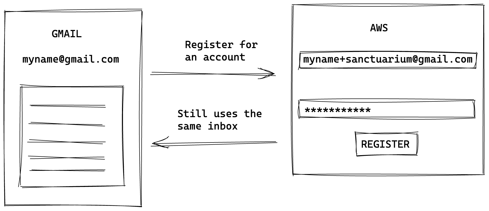

To create an IAM user that I'll use for general administration:

- Go to the [IAM service > Users > Add Users](https://us-east-1.console.aws.amazon.com/iam/home#/users$new?step=details)
- I enabled both **Access key - Programmatic access** and **Password - AWS Management Console access**, as I intend to use this IAM user both in the console and the CLI.
- As I'm also the direct user of this account, I set up a custom password and disabled **Require password reset**. If the intention is to set up an IAM user for another person, I'll probably autogenerate
the password and require them to change it upon their first login.

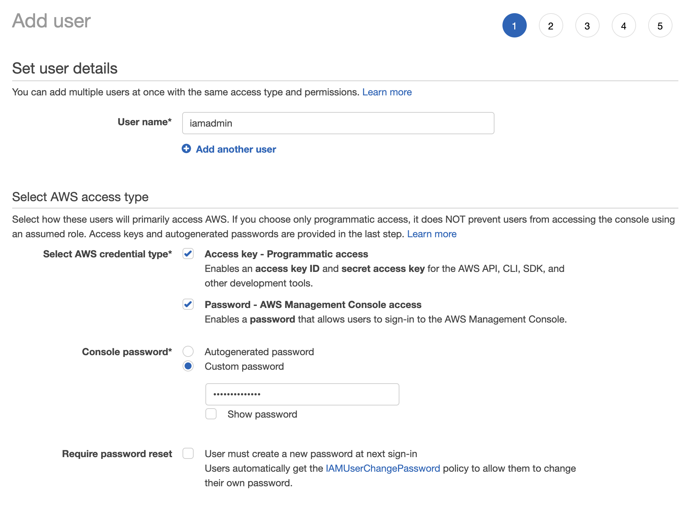

- I then attach the the `AdministratorAccess` policy directly. This allows the IAM user to perform administrative operations on all AWS resources.

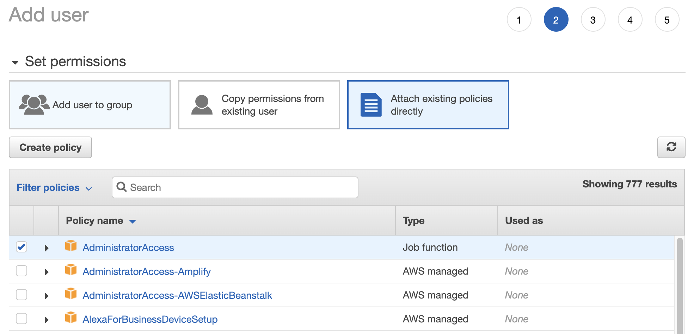

- I skip tags and proceed to create the user.
- I was then presented the option to download a CSV file containing the newly created user's credentials. I downloaded it for safekeeping.

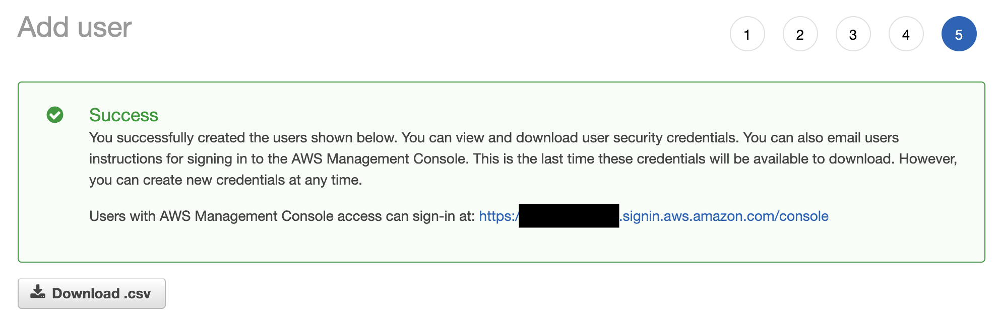

### I can already access all of AWS' offerings from the root user. Why do I need an IAM user?

A root user has 100% unfiltered access to an account's resources and permissions. It is regarded as best practice to create an IAM user that you can use for administration as the first thing you do
once you got a root user set up. This greatly reduces the risk in the event of credential leakage -- a leaked IAM user can only access whatever the permissions alloted to them allows. If a root user credential is leaked, everything under that AWS account is compromised.

## Set up MFA for your root user, turn off all root user API keys.

- Go to [IAM > Add MFA > Activate MFA](https://us-east-1.console.aws.amazon.com/iam/home#/security_credentials$mfa)
- I'm choosing **Virtual MFA**, with the intention of using [Authy](https://authy.com/) as my MFA device.

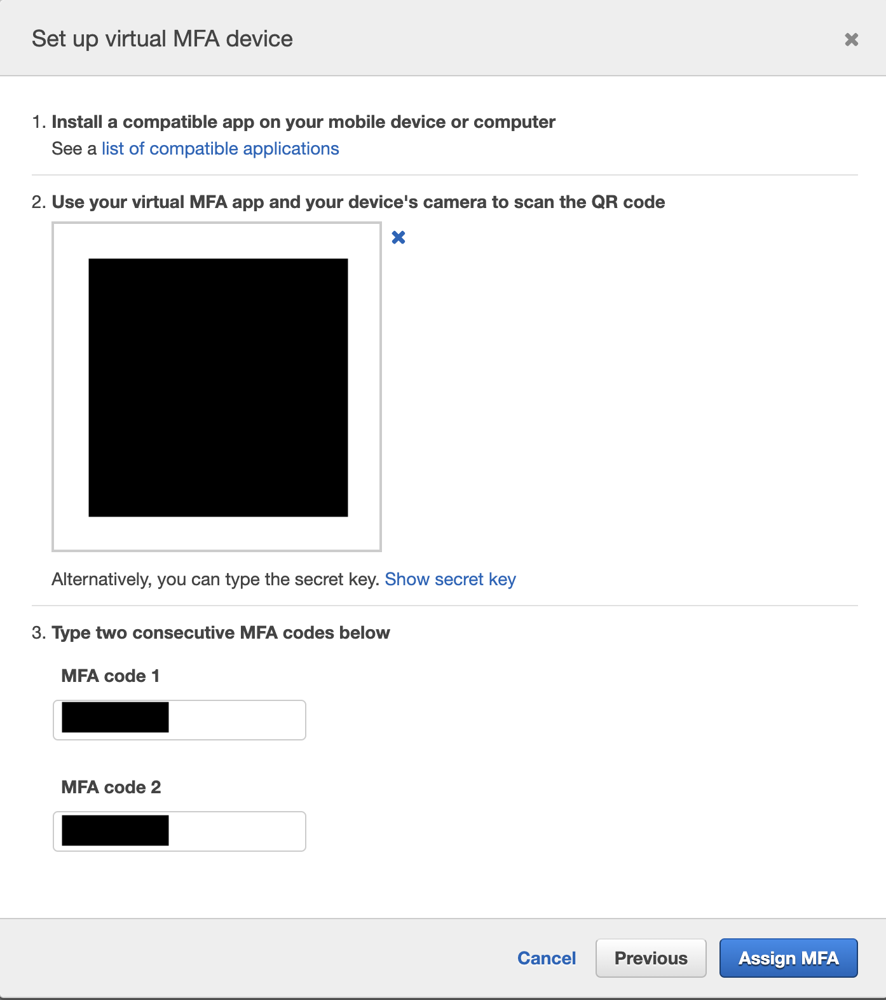

- As for the "turn off all root user API keys" part, there are no root user API keys automatically created when I registered for a new AWS account. Perhaps one is created automatically at the time of writing?

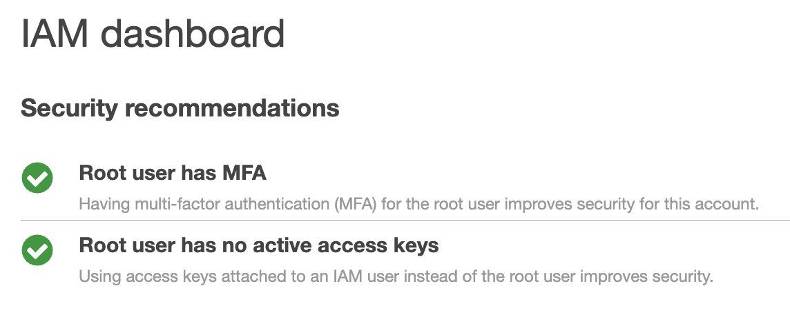

## Set up Billing Alerts for anything over a few dollars.

- Go to [AWS Budgets > Create a Budget](https://us-east-1.console.aws.amazon.com/billing/home#/budgets)
- I've selected the **Monthly cost budget** template with a $10 threshold, set to notify me via email.

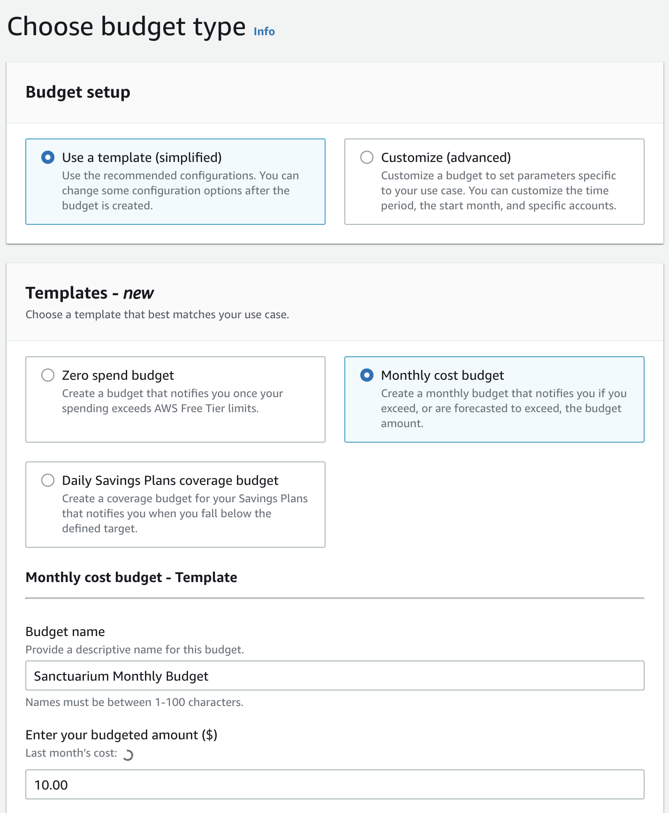
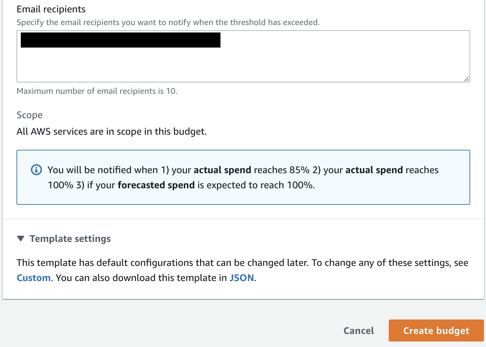

## Extra: Account Alias and Enabling IAM Users to access Billing Information

While I'm still in the AWS Console, I'll also take the extra step to setup an account alias...

- Go to IAM > "Create" account alias on the right side
- Put in an easy to remember alias
- IAM users can now login to the AWS Console using the new login URL (ex: https://my-aws-alias.signin.aws.amazon.com/console)

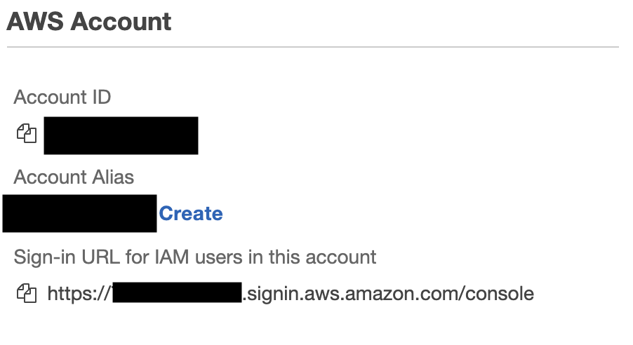

... and also allow IAM users to access billing information:

- Go to [Account](https://us-east-1.console.aws.amazon.com/billing/home#/account)
- Near the bottom of the page, click "edit" besides the **IAM User and Role Access to Billing Information** section.
- Check **Activate IAM Access* and click **Update**

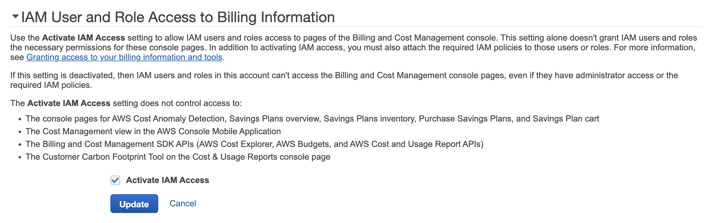

At this point, it's safe to assume that I won't access the root user account except for extraordinary cases. So I logged out and tried to login to check if the MFA works, after that I'm not expecting to use the root user anytime soon.

## Configure the AWS CLI for your user using API credentials.

Given that I already have the AWS CLI installed, I'll just link to the [installation instructions](https://docs.aws.amazon.com/cli/latest/userguide/getting-started-install.html).

In order to actually use the AWS CLI, I'll need API tokens from my IAM user. Since I downloaded the CSV file presented when I created the IAM user, I can just open that file and see the keys. But for completion's sake, here's how one would create a new set of API credentials:

- Login to the IAM User account
- Go to [IAM > Users]
- Click the `iamadmin` user
- Click the **Security credentials** tab
- Click **Create access key**

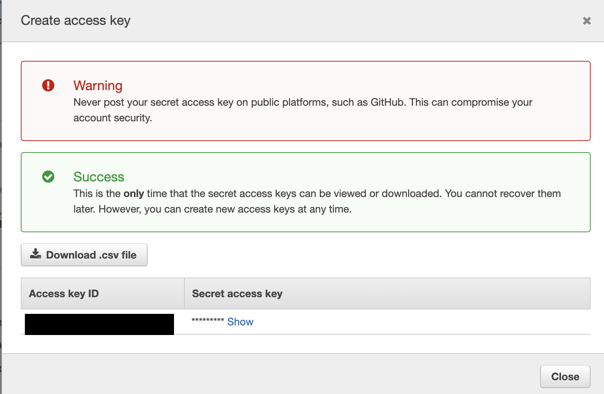

I already have a bunch of API keys in my machine -- the way I handle multiple AWS accounts via the CLI is through [named profiles](https://docs.aws.amazon.com/cli/latest/userguide/cli-configure-profiles.html).

- Run this command: `aws configure --profile profile-name`
- Fill out the fields. I selected `us-east-1` and `json` as my default region and output format, respectively.

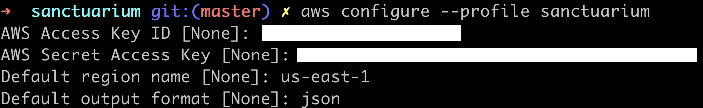

## Checkpoint: You can use the AWS CLI to interrogate information about your AWS account.

```console
$ aws iam get-user --profile sanctuarium
{
    "User": {
        "Path": "/",
        "UserName": "iamadmin",
        "UserId": "********",
        "Arn": "arn:aws:iam::"********",:user/iamadmin",
        "CreateDate": "2022-10-30T20:43:47+00:00",
        "PasswordLastUsed": "2022-11-01T11:10:09+00:00"
    }
}
```