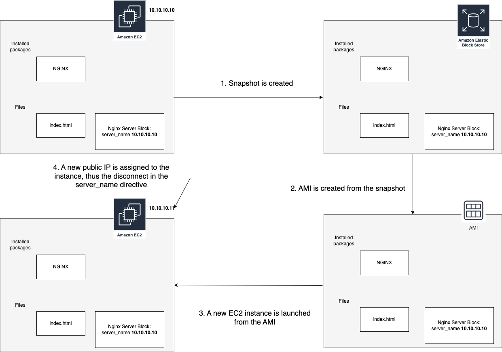

## Web Hosting Basics

Here are the steps that I'll take for this section:

- Deploy a EC2 VM and host a simple static "Coming Soon" web page.
- Take a snapshot of your VM, delete the VM, and deploy a new one from the snapshot. Basically disk backup + disk restore.
- Checkpoint: You can view a simple HTML page served from your EC2 instance.

## Deploy a EC2 VM and host a simple static "Coming Soon" web page.

### Create an EC2 instance

- Go to [EC2 > Key Pairs > Create key pair](https://us-east-1.console.aws.amazon.com/ec2/home?region=us-east-1#CreateKeyPair:)
    - Name: sanctuarium-web-server-key-pair
    - Leave the rest as default
    - Download the pem file for safekeeping
- Go to [EC2 > Launch Instances](https://us-east-1.console.aws.amazon.com/ec2/home?region=us-east-1#LaunchInstances:)
- Everything default except:
    - Name: Sanctuarium Web Server
    - AMI: Ubuntu Server 22.04 (ami-08c40ec9ead489470)
    - Key pair: select the keypair from the prior step
    - Allow SSH from anywhere
    - Allow HTTP Traffic from anywhere
- Upon creation, take note of its public IP.

### SSH to the instance

```console
# on my local machine
PEMFILE=sanctuarium-web-server-key-pair.pem
SERVER_IP=100.10.10.10
SERVER_USER=ubuntu
chmod 400 $PEMFILE
ssh $SERVER_USER@$SERVER_IP -i $PEMFILE
```

An alternative is to connect to the instance via [EC2 Instance Connect](https://docs.aws.amazon.com/AWSEC2/latest/UserGuide/Connect-using-EC2-Instance-Connect.html)

### Set up the static web page

The commands that I used to set up the static web page is on this [shell file](../scripts/userdata-full.sh). After running the commands, the static page is now up on the instance's public IP.

## Take a snapshot of your VM, delete the VM, and deploy a new one from the snapshot. Basically disk backup + disk restore.

I'm assuming that this means creating a snapshot of the [EBS volume](https://aws.amazon.com/ebs/) that is attached to the instance.

### Take a snapshot

- Go to [EC2 > Volumes](https://us-east-1.console.aws.amazon.com/ec2/home?region=us-east-1#Volumes:)
- Highlight the instance's volume, click **Actions**, select **Create snapshot**
    - I put in "Sanctuarium Web Server - Coming Soon Snapshot" as the description

### Delete the VM
- Go back to [EC2 > Instances](https://us-east-1.console.aws.amazon.com/ec2/home?region=us-east-1#Instances:)
- Highlight the running instance, click **Instance state**, select **Terminate instance**
- The instance's volume is now deleted as a consequence of the termination.

### Deploy a new one from the snapshot

- Go to [EC2 > Snapshots](https://us-east-1.console.aws.amazon.com/ec2/home?region=us-east-1#Snapshots:)
- Highlight the snapshot, click **Actions**, select **Create image from snapshot**
    - Image Name: SanctuariumWebServerComingSoon
    - Description: Sanctuarium Web Server containing a "Coming Soon" static page
    - The rest I leave as default.
- Go to [EC2 > AMIs](https://us-east-1.console.aws.amazon.com/ec2/home?region=us-east-1#Images:visibility=owned-by-me)
- Highlight the AMI, click "Launch Instance from AMI"
- Everything default except:
    - Name: Sanctuarium Web Server
    - Key pair: select the keypair from the prior step
    - Allow SSH from anywhere
    - Allow HTTP Traffic from anywhere
    - Toggle "Advanced Details", scroll to the bottom and look for "User data"
        - In the text field, paste the commands for setting up the nginx server block and restarting nginx. Here's a standalone [shell file version](../scripts/userdata-update-server-name.sh) ([why?](#extra-why-is-the-user-data-needed-when-launching-the-ami))
    - Launch the instance

## Checkpoint: You can view a simple HTML page served from your EC2 instance.

Copy the Public IP of the EC2 instance and you should be able to see the static page again.

## Extra: Why is the User Data needed when launching the AMI?

Without the user data, accessing the IP address will show the default Nginx page, signifying that the prior installations has persisted. But where's the coming soon page? Everything is actually still in the EC2 instance -- what's happening is that our custom Sanctuarium server block has the old EC2 instance's IP address as the `server_name`. 



Running the User Data script allows the new instance to fetch its own IP address and update the nginx server block. Note that one could also put the contents of the [setup shell script](../scripts/userdata-full.sh) when launching a fresh Ubuntu EC2 instance and get the same outcome as with [running the commands manually](#set-up-the-static-web-page).